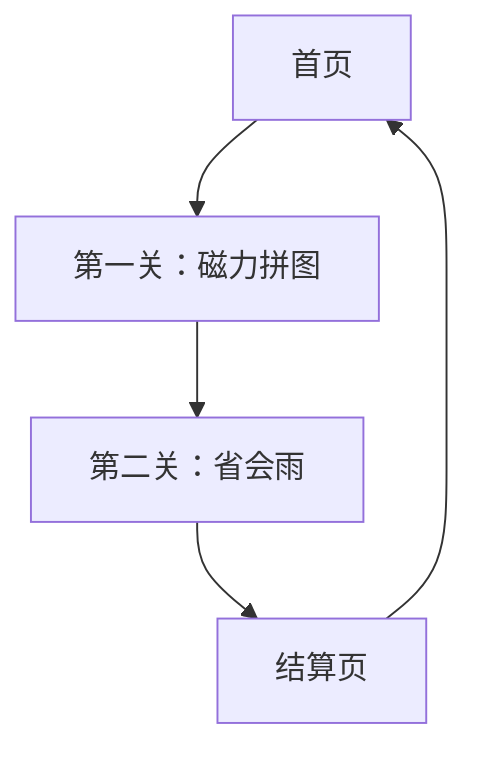

## 1. 产品概述
拼拼中国（PinPin China）是一款面向 Web（HTML5/Canvas）的轻量级益智游戏，支持移动端与桌面端。玩家通过拖拽拼图与点击匹配省会，在趣味互动中熟悉中国省级行政区形状与省会。产品定位：寓教于乐、短时沉浸、即开即玩。

## 2. 核心功能

### 2.1 用户角色
| 角色 | 注册方式 | 核心权限 |
|------|----------|----------|
| 游客 | 无需注册 | 进入游戏、本地排行榜 |
| 会员 | 邮箱/第三方登录（可选） | 云存档、成就徽章 |

### 2.2 功能模块
本游戏包含以下最小页面集合：
1. **首页**：开始游戏、难度选择、音效开关
2. **第一关**：磁力拼图，拖拽省份至凹槽并吸附
3. **第二关**：省会雨，点击匹配掉落方块（含 5 秒“Pair Pool”规则）
4. **结算页**：得分、评价、重玩/分享

### 2.3 页面详情
| 页面 | 模块 | 功能描述 |
|------|------|----------|
| 首页 | 开始按钮 | 进入第一关 |
| 首页 | 难度选择 | 切换拼图数量与掉落速度 |
| 首页 | 音效开关 | 全局静音/开启 |
| 第一关 | 拼图槽 | 显示轮廓与吸附反馈 |
| 第一关 | 拼图块 | 可拖拽、自动吸附、播放音效与粒子 |
| 第二关 | 掉落区 | 省形状与省会名方块自上而下掉落 |
| 第二关 | 点击匹配 | 选中→再点击匹配，成功则消除并加分 |
| 第二关 | Pair Pool | 5 秒内必须生成对应省会名，否则游戏结束 |
| 结算页 | 得分展示 | 显示总分与星级 |
| 结算页 | 重玩/分享 | 本地重玩或生成分享图 |

## 3. 核心流程
游客打开首页 → 选择难度 → 进入第一关（磁力拼图）→ 完成全部拼图 → 进入第二关（省会雨）→ 在 5 秒内匹配“省份-省会”对 → 失败则游戏结束，成功则继续 → 结算页查看得分与评价。

## 4. 用户界面设计

### 4.1 设计规范
- 主色：#FF6B6B（活力红），辅色：#4ECDC4（青绿）
- 按钮：圆角 8 px，悬停放大 1.05 倍，点击阴影
- 字体：思源黑体，标题 28 px，正文 16 px
- 布局：卡片式，顶部导航栏，底部操作栏
- 图标：扁平化，使用 Emoji 或 SVG 图标库

### 4.2 页面设计概览
| 页面 | 模块 | UI 元素 |
|------|------|---------|
| 首页 | 开始按钮 | 大号圆角按钮，主色背景，白色文字，悬停发光 |
| 第一关 | 拼图槽 | 半透明描边，吸附成功时高亮闪光 |
| 第二关 | 掉落方块 | 省形状用轮廓填充，省会名用圆角标签，掉落加速 |
| 结算页 | 得分星级 | 五星评分，动态数字跳动，分享按钮带二维码 |

### 4.3 响应式策略
桌面优先：默认 1280×720 画布，移动端自动缩放并启用触摸优化（防抖 16 ms）。

## 5. 音效与性能
- 音效：拖拽、吸附、消除、失败、胜利共 5 段，压缩至 64 kbps AAC/OGG，总大小 < 300 KB
- 性能目标：同屏精灵 ≤ 40 个，帧率 60 FPS，低端机可降至 30 FPS
- 加载策略：首屏预加载核心资源，后续按需懒加载

## 6. 资产处理要求 (Asset Pipeline)
- **核心数据源**: `/map_materials/中华人民共和国各省.geojson` (必须包含 name 和 geometry)
- **数据处理**: 
    - 不再解析 SVG 路径。
    - 使用脚本将 GeoJSON 经纬度投影转换为游戏坐标系 (Pixel)。
    - 生成优化的 JSON 数据供游戏加载。
- **输出格式**: RDP 简化后的顶点数组，确保碰撞检测性能。
- **校验标准**: 必须完整识别 34 个省级行政区 (含港澳台)，不得遗漏。

## 7. 里程碑与验收
- M1：资产校验脚本可运行并输出 ≥ 30 个省数据
- M2：第一关磁力拼图可拖拽吸附，完成全部拼图
- M3：第二关省会雨掉落与 5 秒 Pair Pool 逻辑完整
- M4：音效、粒子、结算页与分享功能上线
- M5：移动端触摸优化与性能达标，准备发布