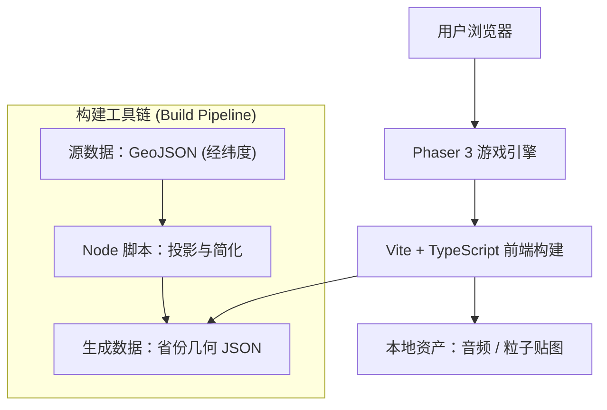

## 1. Architecture Design


## 2. Technology Description
- **前端核心**: Phaser 3.60+ (WebGL 渲染, Arcade Physics)
- **开发语言**: TypeScript @ 5.x
- **构建工具**: Vite @ 5.x
- **数据处理 (Node.js)**:
    - Input: `中华人民共和国各省.geojson` (Standard GeoJSON with Adcodes)
    - Projections: `d3-geo` (For Mercator projection: Lng/Lat -> Pixel)
    - Simplification: `simplify-js` (High-performance polyline simplification)

## 3. Route Definitions
| Route | Purpose |
|-------|---------|
| `/` | **首页 (Home)**: 游戏入口、难度设置、全屏切换 |
| `/play` | **游戏主场景**: 包含 Level 1 (拼图) 和 Level 2 (消除) 的无缝切换 |
| `/result` | **结算页**: 评分展示、分享卡片生成 |

*注：建议将 Level 1 和 Level 2 合并为一个 Scene 或使用 Phaser 的 Scene Manager 平滑过渡，减少页面跳转带来的割裂感。*

## 4. Data Pipeline (Crucial Redesign)
**由于原始 SVG 缺乏省份 ID 信息，现改为基于 GeoJSON 的处理管线。**

### 4.1 数据流
1.  **Source**: `/map_materials/中华人民共和国各省.geojson`
    *   Contains: `geometry` (Polygon/MultiPolygon), `properties.name` (e.g., "四川省"), `properties.adcode`.
2.  **Build Script (`scripts/build-map-data.ts`)**:
    *   **Load**: Read GeoJSON.
    *   **Project**: 使用墨卡托投影 (Mercator) 将经纬度映射到 `1600x1200` (或适配屏幕比例) 的逻辑坐标系。
        *   `Center`: 计算中国地图几何中心。
        *   `Scale`: 缩放以填充画布并预留 Padding。
    *   **Simplify**: 对投影后的坐标点进行 RDP (Douglas-Peucker) 简化，容差设为 `0.5px`，大幅减少渲染顶点数。
    *   **Output**: 生成 `src/assets/map_data.json`。

### 4.2 输出数据结构 (Runtime Data)
```typescript
interface GameMapData {
  width: number;
  height: number;
  provinces: {
    name: string;      // "北京市"
    adcode: number;    // 110000
    center: {x, y};    // 视觉中心 (用于吸附判定)
    bounds: {minX, minY, width, height};
    path: string;      // SVG Path String (用于视觉绘制 / 遮罩)
    points: {x, y}[]; // 简化后的多边形顶点 (用于物理碰撞体 / 交互区域)
  }[];
}
```

## 5. Implementation Roadmap
1.  **Setup**: Initialize Vite + Phaser + TS project.
2.  **Pipeline**: Write `build-map-data.ts` using `d3-geo` simplified.
3.  **Core (L1)**: Implement `MapPiece` class (Drag & Drop, Snapping).
4.  **Core (L2)**: Implement `FallingObject` class and Matching Logic.
5.  **Polish**: Add "Juice" (Particles, Tweens, Audio).

## 6. Conclusion
此架构移除了对不规范 SVG 的依赖，转而使用数据完备的 GeoJSON，从根本上保证了游戏逻辑（如省份识别、匹配）的可行性。Phaser 3 配合预处理好的几何数据，能轻松实现 60FPS 的丝滑体验。