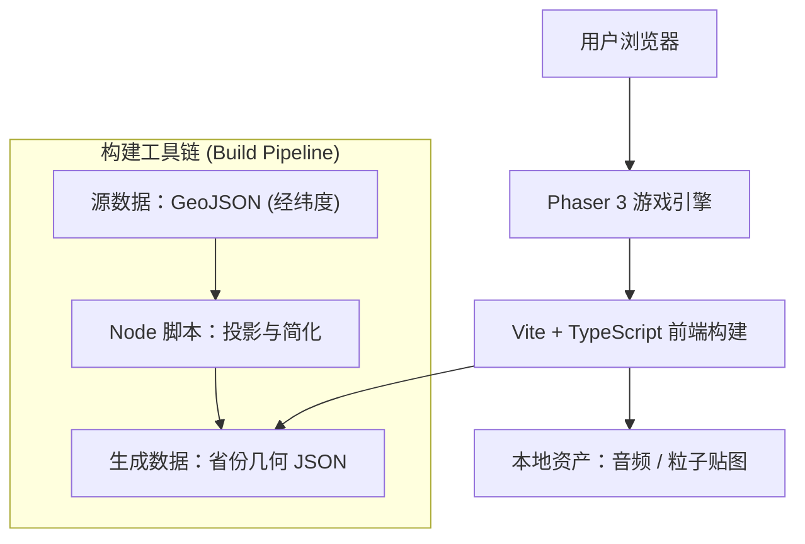

## 1. Architecture Design


### 3. Rendering Strategy (Phaser 3)
*   **Procedural Texture Generation (`MapTextureGenerator`)**:
    *   **3D Extrusion**: Generates 'thick' puzzle pieces by rendering the province shape multiple times with vertical offsets (STACK_DEPTH=6) to texture.
    *   **Flag Textures**: procedurally generates a "Five-Star Red Flag" texture for each province. Key innovation: Calculates the **Map Content Bounds** (not Canvas bounds) to align the flag stars correctly over the Xinjiang/Gansu region, ensuring the flag looks continuous when assembled.
    *   **Outer Border Texture (Level 2)**: [NEW] Generates a unified China silhouette without internal province boundaries for Hard Mode.
*   **Scene Organization**:
    *   **Layering (Critical Strategy)**:
        *   `Background`: Z=-100 (Ensure it never occludes map)
        *   `Map Outline`: Z=-1 (Visible over background, under pieces)
        *   `Slots`: Z=1 (Flat White, mostly invisible in L2 except visual debugging)
        *   `Pieces`: Z=10+ (3D Extruded) -> Scale/Depth managed dynamically.
        *   `Labels`: Z=2000 (Top Layer).
    *   **Performance**: Textures are generated *once* at startup (`preload`). During gameplay, standard Sprites are used, minimizing draw calls.

### 3.1 Level 2 Hard Mode Mechanics
*   **Outer Border Only Map**:
    *   `MapTextureGenerator.generateOuterBorderSlot()` draws only China's outer boundary (国界线).
    *   Implementation: Merge all province polygons and draw only the outer contour.
*   **Conditional Label Visibility**:
    *   `MapPiece` constructor checks if province is 直辖市 (北京/上海/天津/重庆) or 特别行政区 (香港/澳门).
    *   Non-visible labels: `setVisible(false)` until `snapTo()` is called.
*   **No Hover Hint**:
    *   In Hard Mode, `GameScene.checkSlotHighlighting()` is skipped during drag.
    *   `MapPiece` checks `difficulty` property. If `'hard'`, suppresses Drag Tint/Scale effects to prevent visual hinting or confusion.
*   **Precision Snap (Distance-Based)**:
    *   Snap check only occurs on `dragend` event (mouse release).
    *   **Algorithm**: Calculates Euclidean distance between piece center and slot center.
    *   **Threshold**: Distance < 15% of piece diagonal length (More reliable than simple overlap for irregular shapes like Inner Mongolia).
    *   Failure: Piece animates back to `originalPosition` with error sound.

## 2. Technology Description
- **前端核心**: Phaser 3.60+ (WebGL 渲染, Arcade Physics)
- **开发语言**: TypeScript @ 5.x
- **构建工具**: Vite @ 5.x
- **数据处理 (Node.js)**:
    - Input: `中华人民共和国各省.geojson` (Standard GeoJSON with Adcodes)
    - Projections: `d3-geo` (For Mercator projection: Lng/Lat -> Pixel)
    - Simplification: `simplify-js` (High-performance polyline simplification)
- **渲染技术**:
    - **Procedural Texture Gen**: 使用 `MapTextureGenerator` 在运行时生成高质量纹理。
    - **3D Extrusion**: 通过图层堆叠实现伪 3D 积木效果。
    - **Dynamic Scaling**: 根据屏幕尺寸动态计算最佳缩放比，适配各种设备。

## 3. Route Definitions
| Route | Purpose |
|-------|---------|
| `/` | **首页 (Home)**: 游戏入口、难度设置、全屏切换 |
| `/play` | **GameScene**: Level 1 (Magnetic Map - Easy) |
| `Transition`| **TransitionScene**: Cutsheen managing visual transition (Celebration -> Fade -> Next Level) |
| `/level2` | **Level2HardScene**: Level 2 (Magnetic Map - Hard) |
| `/level3` | **Level3Scene**: Level 3 (formerly L2) Capital Rain |
| `/result` | **结算页**: 评分展示、分享卡片生成 |

*注：建议将 Level 1 和 Level 2 合并为一个 Scene 或使用 Phaser 的 Scene Manager 平滑过渡，减少页面跳转带来的割裂感。*

## 4. Data Pipeline (Crucial Redesign)
**由于原始 SVG 缺乏省份 ID 信息，现改为基于 GeoJSON 的处理管线。**

### 4.1 数据流
1.  **Source**: `/map_materials/中华人民共和国各省.geojson`
    *   Contains: `geometry` (Polygon/MultiPolygon), `properties.name` (e.g., "四川省"), `properties.adcode`.
2.  **Build Script (`scripts/build-map-data.ts`)**:
    *   **Load**: Read GeoJSON.
    *   **Project**: 使用墨卡托投影 (Mercator) 将经纬度映射到 `1600x1200` (或适配屏幕比例) 的逻辑坐标系。
        *   `Center`: 计算中国地图几何中心。
        *   `Scale`: 缩放以填充画布并预留 Padding。
    *   **Simplify**: 对投影后的坐标点进行 RDP (Douglas-Peucker) 简化，容差设为 `0.5px`，大幅减少渲染顶点数。
    *   **Output**: 生成 `src/assets/map_data.json`。

### 4.2 输出数据结构 (Runtime Data)
```typescript
interface GameMapData {
  width: number;
  height: number;
  provinces: {
    name: string;      // "北京市"
    adcode: number;    // 110000
    center: {x, y};    // 视觉中心 (用于吸附判定)
    bounds: {minX, minY, width, height};
    path: string;      // SVG Path String (用于视觉绘制 / 遮罩)
    points: {x, y}[]; // 简化后的多边形顶点 (用于物理碰撞体 / 交互区域)
  }[];
}
```

## 5. Implementation Roadmap
1.  **Setup**: Initialize Vite + Phaser + TS project.
2.  **Pipeline**: Write `build-map-data.ts` using `d3-geo` simplified.
3.  **Core (L1 Easy)**: Implement `MapPiece` class (Drag & Drop, Snapping with Hover Hints).
4.  **Core (L2 Hard)**: [NEW] Implement Hard Mode scene with outer-border map, conditional labels, precision snap.
5.  **Core (L3 Capital Rain)**: Implement `FallingObject` class and Matching Logic.
6.  **Polish**: Add "Juice" (Particles, Tweens, Audio).

## 6. Conclusion
此架构移除了对不规范 SVG 的依赖，转而使用数据完备的 GeoJSON，从根本上保证了游戏逻辑（如省份识别、匹配）的可行性。Phaser 3 配合预处理好的几何数据，能轻松实现 60FPS 的丝滑体验。